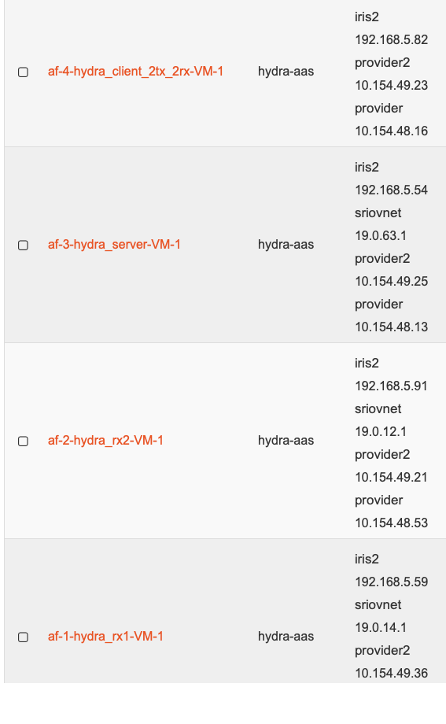

## build

The build script creates all the following VNFD and NS files:

1. hydra_client_2tx_2rx_vnfd.tar.gz
2. hydra_server_vnfd.tar.gz
3. hydra_client_rx2_vnfd.tar.gz
4. hydra_client_rx2_vnfd.tar.gz
5. hydra_basic_nsd.tar.gz

File 5 is a basic experiment consisting of a 2-EVI Base Station (hydra_client_2tx_rx and hydra_server) and 2 clients (rx1 and rx2, for the 1st and 2nd EVI, respectively).

To execute the build script just type:

```
./build
```

## osm

The osm script is a simple utilitaria to easen the task of installing, uninstalling, creating, and deleting VNDFs and NSDs.
Type the following command to get a detailed usage of it:
```
./osm l
```

## basic_nsd

This scenario represents a case with 2 slices (in this case we dont have any performance difference between them).


### Testing

- From "hydra_client_2tx_2rx" ping  the tap interfaces of "hydra_rx1" and "hydra_rx2" with IPs 1.1.1.2 and 2.2.2.2, respectively.
```
ping 1.1.1.2
```
or
```
ping 2.2.2.2
```

- From "hydra_rx1" ping the tap0 interface of ""hydra_client_2tx_2rx", IP 1.1.1.1
```
ping 1.1.1.1
```


- From "hydra_rx2" ping the tap1 interface of ""hydra_client_2tx_2rx", IP 2.2.2.1
```
ping 2.2.2.1
```

## Troubleshooting

Access our OpenStack server. 




Access each VM and kill the python process.


* In machine "hydra-server" exec (replace 192.168.5.54 by the ip of iris2):
```
python ~/gr-hydra/grc_blocks/app/ansible_hydra_gr_server.py --ansibleIPPort 192.168.5.54:5000
```

* In machine "hydra_client_2tx_2rx" exec (replace 192.168.5.82 by the IP of iris2):
```
python ~/gr-hydra/grc_blocks/app/ansible_hydra_gr_client_2tx_2rx.py --ansibleIP 192.168.5.82
```

* In machine "hydra_rx1" exec:
```
python ~/gr-hydra/grc_blocks/app/ansible_hydra_vr1_rx.py
```

* In machine "hydra_rx2" exec:
```
python ~/gr-hydra/grc_blocks/app/ansible_hydra_vr2_rx.py
```
